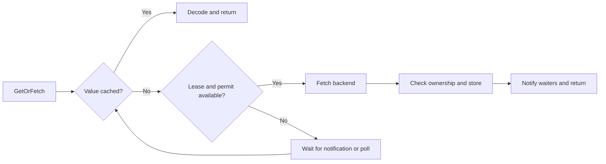

# R2Cache

**Read-through caching for Go, coordinated through Redis.**

[](go.mod)
[](https://pkg.go.dev/github.com/kapitanov/r2cache)
[](LICENSE)


Fetch on demand, keep recently accessed keys warm, and control backend concurrency across application replicas.
R2Cache works with Redis and Valkey, using shared leases to coordinate reads and background refreshes.

[Quick start](#quick-start) · [Configuration](#configuration) · [Refresh](#automatic-refresh) · [Guarantees](#coordination-and-recovery) · [Development](#development)

## Why R2Cache?

| Feature                       | What it does                                                            |
| ----------------------------- | ----------------------------------------------------------------------- |
| **Read-through caching**      | Returns a cached value or fetches and stores it on a miss.              |
| **Distributed singleflight**  | Coordinates equivalent fetches across replicas during normal operation. |
| **Global concurrency limits** | Shares a backend request budget across reads and refreshes.             |
| **Automatic refresh**         | Refreshes recently accessed keys, spacing requests to reduce bursts.    |
| **Typed values**              | Supports string-like keys, generic values, and pluggable serialization. |
| **Metrics callbacks**         | Reports local activity counters and a shared hot-key count.             |

The name stands for **Redis + Read-through**. Redis stores both cached values and
the coordination state; no separate coordinator is needed.

## Quick start

You need **Go 1.27+** and a reachable Redis or Valkey server.

```sh
go get github.com/kapitanov/r2cache
```

Supply a connection, a namespace, and a function that loads a value from your backend:

```go
package main

import (
	"context"
	"log"
	"time"

	"github.com/kapitanov/r2cache"
)

type Product struct {
	ID   string `json:"id"`
	Name string `json:"name"`
}

func main() {
	cache, err := r2cache.NewBuilder[string, Product]().
		RedisURL("redis://localhost:6379/0").
		KeyPrefix("my-products-v1").
		Fetch(func(ctx context.Context, id string) (Product, error) {
			// Replace with a database or API request that honors ctx.
			if err := ctx.Err(); err != nil {
				return Product{}, err
			}
			return Product{ID: id, Name: "Example product"}, nil
		}).Build()
	if err != nil {
		log.Fatal(err)
	}

	defer cache.Shutdown()

	ctx, cancel := context.WithTimeout(context.Background(), 5*time.Second)
	defer cancel()

	product, err := cache.GetOrFetch(ctx, "my-product")
	if err != nil {
		log.Print(err)
		return
	}

	log.Printf("%+v", product)
}
```

The first read fetches and caches the value. Later reads use it until its TTL
expires. `Build` validates configuration and starts workers; it does **not** check
Redis connectivity.

Keys may be `string` or a named string type. Values may be any type supported by
your serializer. Specify both types once in `NewBuilder[K, V]()`; setter calls
need no type arguments.

### Runnable example

[`example/example.go`](example/example.go) runs a complete demonstration with two
cache replicas and a simulated product backend. It shows cache hits, concurrent
reads of the same and different keys, automatic refresh, metrics, uncached backend
errors, request cancellation, and graceful shutdown.

Start a disposable Redis server in one terminal:

```sh
docker run --rm -p 127.0.0.1:6379:6379 redis:7.4.2-alpine
```

Then run the example from the repository root:

```sh
go run ./example
go run ./example -redis-url redis://localhost:6379/0 -readers 20 -backend-latency 200ms
```

The URL also defaults from `REDIS_URL`. Each run uses a unique namespace and
finishes automatically; Ctrl+C cancels it cleanly. Use `-prefix my-example-v1` only
with an unused namespace so earlier cached snapshots do not affect the demonstration.
The program never flushes Redis; values and hot-key indexes expire after the run.
Run `go run ./example -help` for all flags.

## How a read works



Only successful fetches are stored. Cache hits do not extend the TTL; successful
writes and refreshes start a new TTL. Backend errors are not cached or shared as
results, so a waiter may retry after a failed owner releases its lease.

Redis and serialization errors are returned to the caller. Redis failures do not
trigger uncoordinated backend calls. A value that fails to decode remains in Redis
until expiry or external removal.

## Configuration

Create a builder with `NewBuilder[K, V]()`. Setters return the same builder for
chaining, or can be called separately. Later calls override earlier settings.
`Build()` validates the final configuration; invalid settings can be corrected
and built again. Each successful build starts an independent cache with a snapshot
of the settings. Shut down every cache you build.

Builders are not safe for concurrent use. Callbacks, serializers, and injected
Redis clients remain shared and must support concurrent use.

| Method                        | Default            | Purpose                                                            |
| ----------------------------- | ------------------ | ------------------------------------------------------------------ |
| `RedisURL` / `UseRedisClient` | Required           | Select the Redis connection.                                       |
| `Fetch`                       | Required           | Load a value from the backend.                                     |
| `KeyPrefix`                | Empty namespace    | Isolate unrelated caches and coordinate replicas.                  |
| `TTL`                      | `5 * time.Minute`  | Set the lifetime of each stored value; minimum 1 ms.               |
| `LeaseDuration`            | `30 * time.Second` | Set the recovery window for abandoned fetches; minimum 100 ms.     |
| `LimitConcurrentFetches`      | Unlimited          | Limit active backend calls across the namespace; must be positive. |
| `EnableAutoRefresh`           | Disabled           | Refresh recently accessed keys using a policy.                     |
| `DisableAutoRefresh`          | —                  | Override an earlier refresh setting.                                |
| `UseJSONSerializer`           | Compact JSON       | Restore the default JSON serializer.                              |
| `UseSerializer`               | Compact JSON       | Customize value encoding and decoding.                             |
| `MetricsReceiver`          | Disabled           | Receive periodic metrics snapshots.                                |

Use a versioned namespace such as `my-products-v1`. Every replica sharing it must
agree on value types, serialization, fetch semantics, TTL, lease duration,
concurrency limit, and refresh policy.

### Serialization

The default serializer uses `encoding/json`, including custom JSON marshalers and
unmarshalers. A custom serializer implements:

```go
type Serializer[V any] interface {
	Marshal(V) ([]byte, error)
	Unmarshal([]byte, *V) error
}
```

Pass it with `builder.UseSerializer(serializer)`. Its methods must be safe for
concurrent use. Use a new namespace when introducing an incompatible encoding.

## Automatic refresh

Configure the builder to keep hot entries warm while limiting backend work:

```go
builder.TTL(5 * time.Minute)
builder.LimitConcurrentFetches(10)
builder.EnableAutoRefresh(r2cache.AutoRefreshPolicy{
	HotKeyLifetime: time.Minute,
	UpdateInterval: 30 * time.Second,
})
```

**Hotness follows external reads.** A key stays eligible for `HotKeyLifetime`
after its last `GetOrFetch` access. Background refreshes and `HotKeys` queries do
not extend that window.

**Refresh work is paced across replicas.** Successful fetches schedule the next
refresh after `UpdateInterval`. The shared scheduler spaces starts by approximately
`UpdateInterval / hot-key-count`; each replica runs one background fetch worker.
Foreground fetches and refreshes share the same leases and concurrency limit.

Both policy durations must be at least 1 ms. Intervals are best-effort: slow
backends, busy permits, and scheduler polling can delay work. Failed or busy
refreshes are retried on a later interval, while an existing value remains only
until its original TTL. Set the refresh interval below the TTL with room for
backend latency. Idle scheduler polling is at most every 100 ms.

`cache.HotKeys(ctx)` returns eligible keys across the namespace, oldest access
first. It returns `nil` when refresh is disabled or the cache, context, or Redis
is unavailable. Its slice-only signature cannot distinguish an unavailable result
from an empty set.

## Coordination and recovery

Atomic Lua scripts acquire per-key leases and optional global permits, renew them,
and check ownership before storing a result. Waiters use Pub/Sub notifications
with a 100 ms polling fallback for missed signals and abandoned leases.

Leases renew every third of their duration. A process pause, network partition,
or Redis failover can allow recovery to overlap an old backend call. That can
also temporarily exceed the configured concurrency limit. Expired owners cannot
overwrite a replacement's result, but backend operations must still be safe to repeat.

| Error          | Meaning                                           |
| -------------- | ------------------------------------------------- |
| `ErrClosed`    | A read started after shutdown began.              |
| `ErrLeaseLost` | The fetch could not retain or verify ownership.   |
| Other errors   | Backend, serialization, Redis, or context errors. |

Use `errors.Is` to recognize sentinel and context errors. Coordinate through
primaries and keep coordination keys out of eviction: use `maxmemory-policy noeviction`
and provision enough memory for the working set.

### Cancellation and shutdown

Fetchers must support concurrent calls and honor their contexts. Canceling a waiter
does not cancel another caller's fetch. Background calls have no automatic fetch
deadline, so apply timeouts to backend requests as needed.

Call `cache.Shutdown()` when finished. It is idempotent, cancels work, and waits for
active operations and callbacks. Do not call it from a fetcher or metrics receiver,
since it would wait for that callback to return. Shared cached values remain intact.

## Redis, Valkey, Sentinel, and Cluster

`RedisURL` accepts standalone `redis://` and TLS `rediss://` connections. R2Cache
owns that client and closes it during shutdown.

For Sentinel, Cluster, or custom authentication and transport, construct a
`redis.UniversalClient` and pass it through `builder.UseRedisClient(client)`:

```go
// Import "github.com/redis/go-redis/v9".
client := redis.NewUniversalClient(&redis.UniversalOptions{
	Addrs:                 []string{"my-sentinel:26379"},
	MasterName:            "my-master",
	ContextTimeoutEnabled: true,
})
```

Use `redis.NewClusterClient` for an explicit Cluster configuration. Injected clients
remain caller-owned: shut down their caches before closing them. Configure clients
to honor context deadlines and read from primaries.

`builder.KeyPrefix("my-cache")` preserves the prefix exactly and adds a `:` separator:
keys include `my-cache:value:<encoded-key>` and `my-cache:hot`. Prefixes are never
hashed, escaped, or trimmed. An empty prefix adds no separator; a prefix already
ending in `:` retains it, so `my-cache:` produces `my-cache::value:<encoded-key>`.
User keys in value and lock names remain URL-safe base64 encoded.

For **Redis Cluster**, supply a non-empty Redis hash tag yourself, for example
`builder.KeyPrefix("my-cache:{products}")`. This keeps all keys in
**one Cluster hash slot** so multi-key scripts and global limits work; without a
shared tag, operations can fail with `CROSSSLOT`. A namespace is bounded by one
shard's capacity; different tags may use different shards.

The previous SHA-256 namespace layout is no longer read. Existing values expire
normally, and the new layout starts cold. Deploy the same key-layout version to
all cooperating replicas; old and new layouts do not share fetch coordination.

The test matrix covers Redis 7.4 and Valkey 8.0, plus Redis Cluster script execution
and Sentinel discovery. Multi-node failover and resharding are not simulated.

## Metrics

Register a callback with `builder.MetricsReceiver(receiver)`. It receives a
`MetricValues` sample once per second; slow callbacks or Redis queries can delay delivery.

| Field               | Scope             | Meaning                                                               |
| ------------------- | ----------------- | --------------------------------------------------------------------- |
| `HitCount`          | Local, cumulative | Initial reads that found a value, including decoding failures.        |
| `MissCount`         | Local, cumulative | Initial reads that found no value, including waiters.                 |
| `BackendFetchCount` | Local, cumulative | Fetch callback invocations, including refreshes and failures.         |
| `HotKeyCount`       | Global, current   | Eligible hot keys; `0` when refresh is disabled, `-1` if unavailable. |

Counters start at zero per cache and do not reset after delivery. Redis lookup
errors count as neither hits nor misses. Fields are sampled separately, not as
one atomic snapshot. Callbacks run serially per cache and must return promptly;
a receiver shared by several caches must support concurrent calls.

## Development

Start a Docker-compatible daemon and use the Go version in [`go.mod`](go.mod).

| Command      | What runs                                                         |
| ------------ | ----------------------------------------------------------------- |
| `make fmt`   | goimports with the shared lint configuration.                     |
| `make lint`  | Configuration validation and golangci-lint.                       |
| `make test`  | Verbose unit and integration tests, race detection, and coverage. |
| `make check` | Build, vet, lint, and the complete test command.                  |

To run the integration suite against Valkey:

```sh
R2CACHE_TEST_IMAGE=valkey/valkey:8.0.2-alpine make test
```

Tests use **testify** and **testcontainers-go** with real Redis commands and Lua
execution. Containers use allocated ports and are cleaned up automatically; no
existing Redis server or compose setup is needed. Docker must be available, and
the first run needs registry access. For a non-default daemon, configure the
standard Testcontainers environment, including `DOCKER_HOST` where needed.

### Coverage and CI

`make test` ends with a **total coverage percentage** and writes:

| Report                | Path                          |
| --------------------- | ----------------------------- |
| Go coverage profile   | `.out/coverage/coverage.out`  |
| Per-function summary  | `.out/coverage/summary.txt`   |
| Browsable HTML report | `.out/coverage/coverage.html` |

Reports are ignored by Git. Coverage uses atomic counters with the race detector
and measures Go statements, not Lua branches.

The [test workflow](.github/workflows/test.yml) runs a Redis/Valkey matrix and
publishes coverage summaries and artifacts. The separate [lint workflow](.github/workflows/lint.yml)
runs on pushes and pull requests and annotates findings on GitHub. Local formatting,
local linting, and CI share [`.golangci.yml`](.golangci.yml) and the version in
[`.golangci-lint-version`](.golangci-lint-version).

### Project layout

| Location                                           | Responsibility                                            |
| -------------------------------------------------- | --------------------------------------------------------- |
| [`r2cache.go`](r2cache.go)                         | Public cache API, fetch coordination, and lifecycle.      |
| [`builder.go`](builder.go)                         | Configuration, serializers, and metrics contracts.        |
| [`background.go`](background.go)                   | Notifications, refresh scheduling, and metrics delivery.  |
| [`scripts/`](scripts/)                             | Lua scripts with documented keys, arguments, and results. |
| [`scripts.go`](scripts.go)                         | `go:embed` bindings; no runtime script files are needed.  |
| [`docs/implementation.md`](docs/implementation.md) | Design decisions and validation scope.                    |

## License

Released under the [MIT License](LICENSE).
